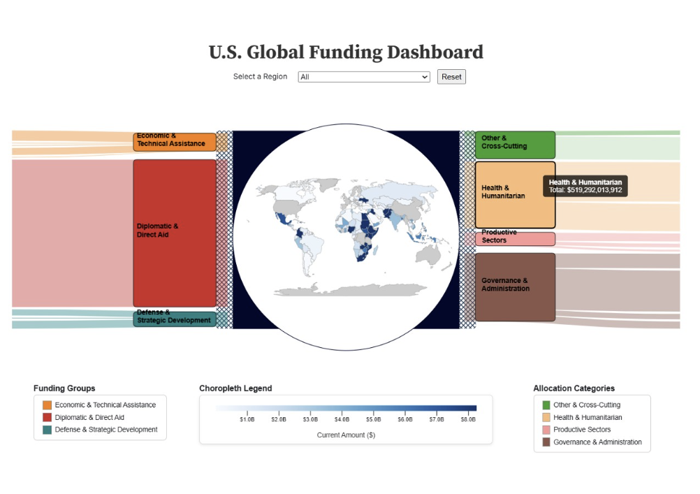
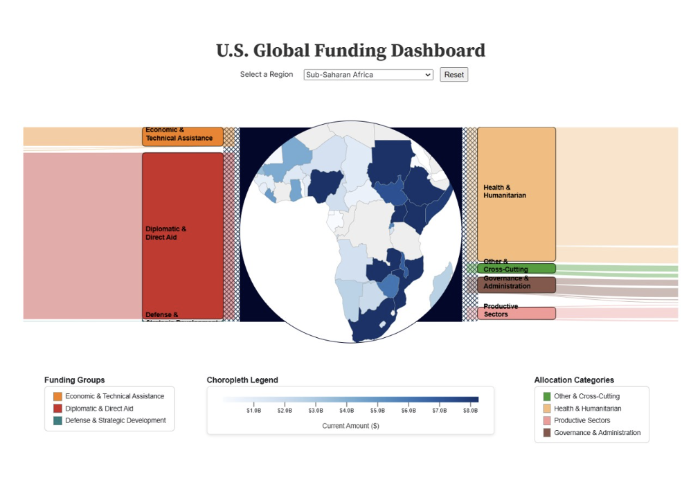

# US Foreign Aid Data Visualization

## Overview
This project explores how U.S. foreign aid is distributed across countries, sectors, and funding categories using an interactive data visualization built with Observable and D3.js.

The goal was to make complex funding flows easier to understand through visual storytelling and interactive exploration.

---

## Key Insights
- A significant portion of funding is concentrated in a few regions, particularly Sub-Saharan Africa
- Health and humanitarian programs account for a large share of total aid allocation
- Funding distribution varies widely across sectors, indicating strategic prioritization
- A small number of countries receive disproportionately high levels of aid

---

## Dashboard Preview

### Full Dashboard


### Regional Filtering (Example: Sub-Saharan Africa)



---

## Features
- Interactive choropleth map showing aid distribution by country
- Flow-based visualization of funding categories and sectors
- Region-based filtering to explore geographic patterns
- Dynamic highlighting of funding allocation across categories

---

## Tech Stack
- JavaScript
- D3.js
- Observable Runtime
- HTML/CSS

---

## Project Structure
```
us-foreign-aid-data-visualization/
├── index.html
├── index.js
├── runtime.js
├── inspector.css
├── package.json
├── files/
│   └── foreign_aid_data.tsv
├── images/
│   ├── dashboard_overview.png
│   └── region_filter.png
└── README.md
```
---

## How to Run

This project runs in the browser using a local server.

1. Clone the repository:
   git clone https://github.com/RISHIKA29/us-foreign-aid-data-visualization.git
   cd us-foreign-aid-data-visualization
2. Start a local server:
   npx http-server
3. Open the provided local URL in your browser.

---

## Business Impact
This dashboard helps users:
- Explore how U.S. foreign aid is distributed across countries and regions
- Compare funding allocation across sectors and categories
- Identify regions receiving higher aid concentration
- Understand complex funding patterns through interactive visual design
- Support policy, research, and data storytelling use cases

---

## Design Notes

The dashboard was designed to prioritize clarity and usability.
The layout focuses on:

Central geographic context (map)
Clear grouping of funding categories
Minimal clutter for easier interpretation

---

## Author

Rishika Reddy
